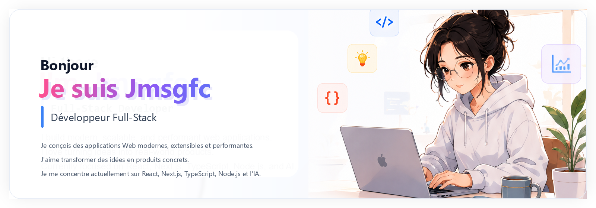

<p align="center">
  <a href="./README.md">English</a> | <a href="./README.zh-CN.md">中文</a> | <a href="./README.ja.md">日本語</a> | <a href="./README.ko.md">한국어</a> | <b>Français</b> | <a href="./README.de.md">Deutsch</a>
</p>

<div align="center">



<br/>

<p align="center">
  <a href="https://www.jmsgfc.me"></a>
  <a href="https://github.com/jmsgfc"></a>
  <a href="https://www.linkedin.com/in/jmsgfc-huang"></a>
  <a href="https://x.com/jmsgfcc"></a>
  <a href="https://discord.com/users/jmsgfc"></a>
  <a href="mailto:a1554561752@gmail.com"></a>
</p>


</div>

---

## 💻 Stack Technique

<table width="100%">
<tr><td align="center">
<b>Frontend</b>
<p>
  
  
  
  
  
  
  
  
  
</p>
</td></tr>
<tr><td align="center">
<b>Backend</b>
<p>
  
  
  
  
  
  
  
  
</p>
</td></tr>
<tr><td align="center">
<b>Outils AI / Agent</b>
<p>
  
  
  
  
  
  
  
  
</p>
</td></tr>
<tr><td align="center">
<b>Base de données / ORM / ODM</b>
<p>
  
  
  
  
  
  
  
</p>
</td></tr>
<tr><td align="center">
<b>Cloud / BaaS</b>
<p>
  
  
  
  
  
</p>
</td></tr>
<tr><td align="center">
<b>Plateformes / Outils</b>
<p>
  
  
  
  
  
  
  
  
  
</p>
</td></tr>
</table>

---

## 📊 Statistiques GitHub

<table width="100%">
<tr>
<td width="50%"></td>
<td width="50%"></td>
</tr>
<tr><td colspan="2" align="center"></td></tr>
</table>

---

## 📈 Graphe des contributions


---

## 👾 Contribution Pac-Man

<p align="center"><picture><source media="(prefers-color-scheme: dark)" srcset="https://raw.githubusercontent.com/jmsgfc/jmsgfc/output/pacman-contribution-graph-dark.svg" /><source media="(prefers-color-scheme: light)" srcset="https://raw.githubusercontent.com/jmsgfc/jmsgfc/output/pacman-contribution-graph.svg" /></picture></p>

---

## 🐍 Contribution Snake

<p align="center"><picture><source media="(prefers-color-scheme: dark)" srcset="https://raw.githubusercontent.com/jmsgfc/jmsgfc/main/assets/github-contribution-grid-snake-dark.svg" /><source media="(prefers-color-scheme: light)" srcset="https://raw.githubusercontent.com/jmsgfc/jmsgfc/main/assets/github-contribution-grid-snake.svg" /></picture></p>

---

## 📊 Résumé du profil

<p align="center"> </p>
<p align="center"> </p>

---

## ⌚ Statistiques hebdomadaires WakaTime

<!--START_SECTION:waka-->

```txt
Total Time: 0 secs

No activity tracked
```

<!--END_SECTION:waka-->

---

## 📝 Activité récente

<!--START_SECTION:activity-->
1. Preparing my GitHub profile README.
<!--END_SECTION:activity-->

---

## 🎯 Priorités actuelles

<table width="100%">
<tr>
<td width="52%" valign="top">
<h3>🚀 </h3>
- Construire des produits SaaS prêts pour la production  
- Approfondir la conception système et le DevOps  
- Explorer les AI agents, MCP et les technologies Web3  
<br/>
<h3>💜 </h3>
- Livrer des outils pratiques avec une vraie valeur utilisateur  
- Contribuer à l’open source et apprendre en public  
- Rester ouvert à la collaboration et aux idées intéressantes  
<br/>
<blockquote>
  <i>Construire des choses utiles.</i><br/>
  <i>Apprendre continuellement.</i><br/>
  <i>Rester ouvert.</i><br/><br/>
  
</blockquote>
</td>
<td width="48%" valign="top">
<h3>✨ </h3>
<p>Je construis des produits web utiles tout en progressant régulièrement en architecture, automatisation et design de workflows IA.</p>
<p align="center">
  
  
  <br/>
  
  
</p>
<br/>
<h3>🧩 </h3>
<p align="center">
  
  
  
  
</p>
<p align="center"></p>
</td>
</tr>
</table>

---

## ⭐ Projets mis en avant

<p align="center">Quelques projets qui représentent le mieux mon travail en outillage, automatisation et ingénierie produit.</p>

<table width="100%" cellpadding="12">
<tr>
<td width="50%" valign="top">
  <a href="https://github.com/jmsgfc/pgshHacker"><b>🖥️ pgshHacker</b></a><br/>
  Outil pratique pour les points PGSH et les exercices guidés.<br/><br/>
  
  
  
</td>
<td width="50%" valign="top">
  <a href="https://github.com/jmsgfc/docx-paper-formatter"><b>📄 docx-paper-formatter</b></a><br/>
  SKILL pour ajuster automatiquement le format de documents académiques.<br/><br/>
  
  
</td>
</tr>
<tr>
<td width="50%" valign="top">
  <a href="https://github.com/jmsgfc/ensp-mcp"><b>🧠 ensp-mcp</b></a><br/>
  Outil d’automatisation réseau MCP pour les agents IA.<br/><br/>
  
  
</td>
<td width="50%" valign="top">
  <a href="https://github.com/jmsgfc/Elective-Course-Management-System-"><b>🎓 Elective Course System</b></a><br/>
  Système de gestion des cours optionnels et des workflows académiques.<br/><br/>
  
  
</td>
</tr>
</table>

<p align="center"><a href="https://www.jmsgfc.me"><b>Voir plus de dépôts &rarr;</b></a></p>

---

## 🌟 Highlights

<table width="100%">
<tr>
<td width="33%" align="center"><b>Construction full-stack</b><br/>Transformer des idées en expériences web abouties.</td>
<td width="33%" align="center"><b>Exploration IA & MCP</b><br/>Créer des outils utiles autour des agents, de l’automatisation et des workflows.</td>
<td width="33%" align="center"><b>Collaboration ouverte</b><br/>Partager des projets, apprendre en public et s’améliorer en continu.</td>
</tr>
</table>

---

## 💌 Me contacter

<p align="center">
  <a href="https://www.jmsgfc.me"></a>
  <a href="https://github.com/jmsgfc"></a>
  <a href="https://www.linkedin.com/in/jmsgfc-huang"></a>
  <a href="https://x.com/jmsgfcc"></a>
  <a href="https://discord.com/users/jmsgfc"></a>
  <a href="mailto:a1554561752@gmail.com"></a>
</p>

<br/>

<p align="center"></p>
