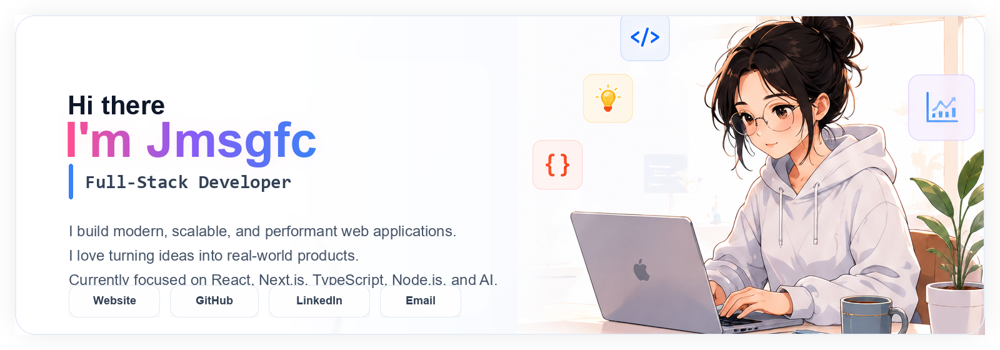

<div align="center">



<br/>

<p align="center">
  <a href="https://www.jmsgfc.me">
    
  </a>
  <a href="https://github.com/jmsgfc">
    
  </a>
  <a href="https://www.linkedin.com/in/jmsgfc-huang">
    
  </a>
  <a href="https://x.com/jmsgfcc">
    
  </a>
  <a href="https://discord.com/users/jmsgfc">
    
  </a>
  <a href="mailto:a1554561752@gmail.com">
    
  </a>
</p>

<h3 align="center">✨ Full-Stack Developer · AI & Web Enthusiast · Lifelong Learner</h3>

<p align="center">
  I build modern, scalable, and user-friendly applications.<br/>
  Passionate about turning ideas into real-world products with <b>React</b>, <b>Next.js</b>, <b>TypeScript</b>, <b>Python</b>, and <b>Node.js</b>.
</p>

</div>

---

## 💻 Tech Stack

<table width="100%">
<tr>
<td width="50%" valign="top">

### Languages

<p>
  
</p>

### Frontend

<p>
  
</p>

### Backend

<p>
  
</p>

</td>
<td width="50%" valign="top">

### Database & Cloud

<p>
  
</p>

### Tools & Others

<p>
  
</p>

### Focus Areas

<p>
  
  
  
  
</p>

</td>
</tr>
</table>

---

## 📊 GitHub Stats

<table width="100%">
<tr>
<td width="50%">
  
</td>
<td width="50%">
  
</td>
</tr>
<tr>
<td colspan="2" align="center">
  
</td>
</tr>
</table>

---

## 📈 Contribution Graph


---

## 🐍 Snake Contribution

<p align="center">
  <picture>
    <source media="(prefers-color-scheme: dark)" srcset="https://raw.githubusercontent.com/jmsgfc/jmsgfc/main/assets/github-contribution-grid-snake-dark.svg" />
    <source media="(prefers-color-scheme: light)" srcset="https://raw.githubusercontent.com/jmsgfc/jmsgfc/main/assets/github-contribution-grid-snake.svg" />
    
  </picture>
</p>

---

## 📊 Profile Summary

<p align="center">
  
</p>

<p align="center">
  
  
</p>

<p align="center">
  
  
</p>

---

## ⌨️ WakaTime Weekly Stats

<!--START_SECTION:waka-->

```txt
Total Time: 0 secs

No activity tracked
```

<!--END_SECTION:waka-->

---

## ⚡ Recent Activity

<!--START_SECTION:activity-->
1. Preparing my GitHub profile README.
<!--END_SECTION:activity-->

---

## 🎯 Current Focus

<table width="100%">
<tr>
<td width="58%" valign="top">

### What I'm Working On

- Building production-ready SaaS products  
- Learning system design and DevOps  
- Exploring AI agents, MCP, and Web3 technologies  

### How I Like To Work

- Shipping practical tools with clear user value  
- Contributing to open source and learning in public  
- Staying open to collaboration and interesting ideas  

</td>
<td width="42%" valign="top" align="left">

### Focus Snapshot

<p>
  Shipping practical web products while steadily leveling up architecture, automation, and AI workflow design.
</p>

<table width="100%">
<tr>
<td width="50%" valign="top">
  
</td>
<td width="50%" valign="top">
  
</td>
</tr>
<tr>
<td width="50%" valign="top">
  
</td>
<td width="50%" valign="top">
  
</td>
</tr>
</table>

<p>
  
  
  
  
</p>

</td>
</tr>
</table>

<p align="center">
  
</p>

---

## ⭐ Featured Projects

<p align="center">
  A few projects that best represent my work across tooling, automation, and product engineering.
</p>

<table width="100%">
<tr>
<td width="50%">
  <a href="https://github.com/jmsgfc/pgshHacker">
    
  </a>
</td>
<td width="50%">
  <a href="https://github.com/jmsgfc/docx-paper-formatter">
    
  </a>
</td>
</tr>
<tr>
<td width="50%">
  <a href="https://github.com/jmsgfc/ensp-mcp">
    
  </a>
</td>
<td width="50%">
  <a href="https://github.com/jmsgfc/play-problem">
    
  </a>
</td>
</tr>
</table>

<p align="center">
  <a href="https://www.jmsgfc.me">
    <b>View more repositories &rarr;</b>
  </a>
</p>

---

## 🏆 Highlights

<table width="100%">
<tr>
<td width="33%" align="center">
  <b>Full-Stack Building</b><br/>
  Turning product ideas into polished web experiences.
</td>
<td width="33%" align="center">
  <b>AI & MCP Exploration</b><br/>
  Building practical tools around agents, automation, and workflows.
</td>
<td width="33%" align="center">
  <b>Open Collaboration</b><br/>
  Sharing projects, learning in public, and improving continuously.
</td>
</tr>
</table>

---

## 💌 Connect With Me

<p align="center">
  <a href="https://www.jmsgfc.me">
    
  </a>
  <a href="https://github.com/jmsgfc">
    
  </a>
  <a href="https://www.linkedin.com/in/jmsgfc-huang">
    
  </a>
  <a href="https://x.com/jmsgfcc">
    
  </a>
  <a href="https://discord.com/users/jmsgfc">
    
  </a>
  <a href="mailto:a1554561752@gmail.com">
    
  </a>
</p>

<br/>

<p align="center">
  <i>"The best way to predict the future is to invent it."</i>
</p>
